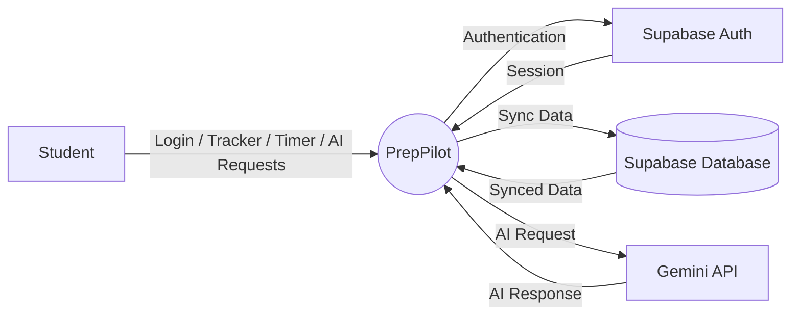
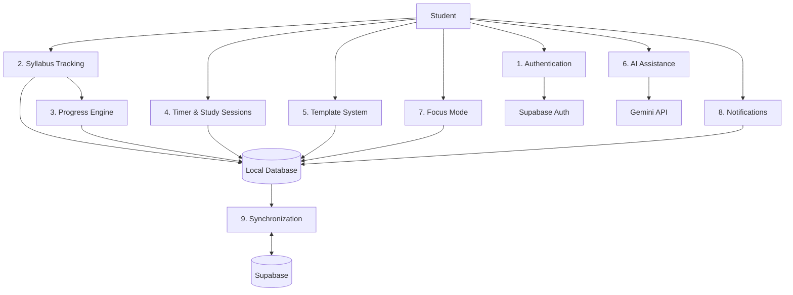
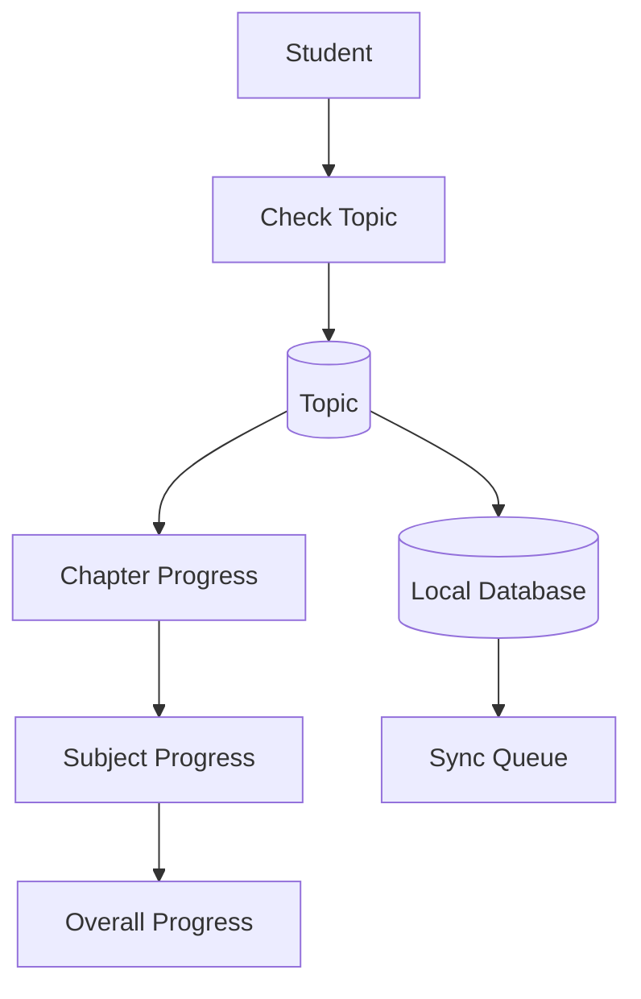
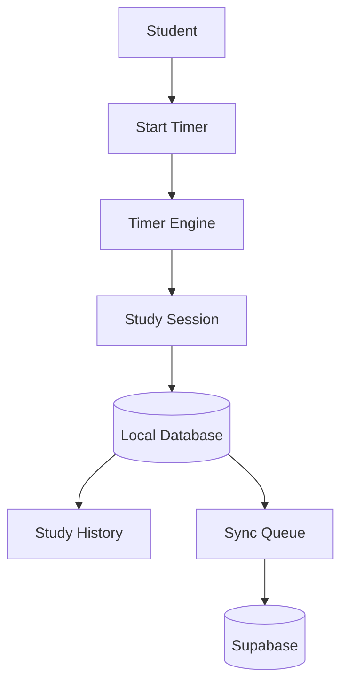
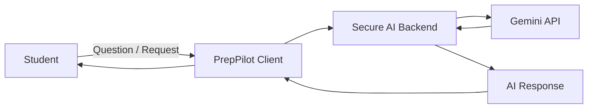
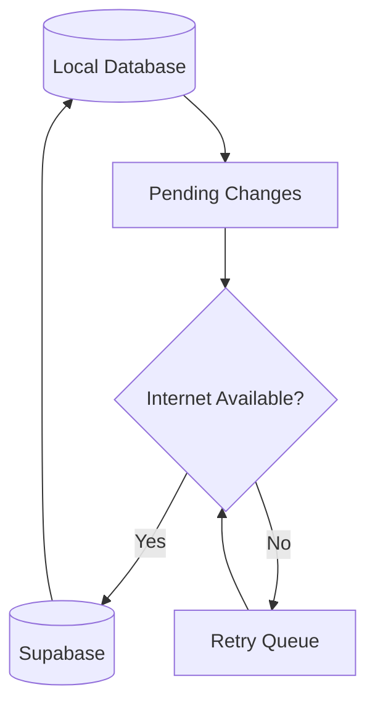

# PrepPilot — Data Flow Diagrams

Mermaid diagrams are used so the DFDs remain editable in Markdown.

## DFD Level 0

## DFD Level 1

## DFD Level 2 — Topic Completion

## DFD Level 2 — Study Session

## DFD Level 2 — AI

## DFD Level 2 — Synchronization

